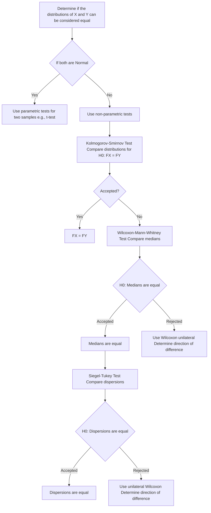
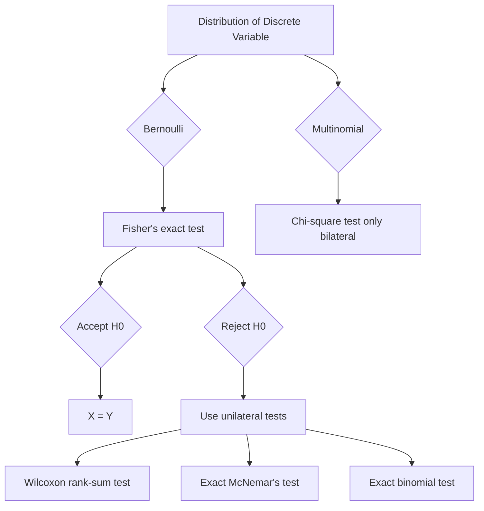

```mermaid
flowchart TB
    A[Determine if the distributions of X and Y can be considered equal]
    A --> B{If both are Normal}
    B --> |Yes| C[Use parametric tests for two samples e.g., t-test]
    B --> |No| D[Use non-parametric tests]
    D --> E[Kolmogorov-Smirnov Test Compare distributions for H0: FX = FY]
    E --> F{Accepted?}
    F --> |Yes| G[FX = FY]
    F --> |No| H[Wilcoxon-Mann-Whitney Test Compare medians]
    H --> I{H0: Medians are equal}
    I --> |Accepted| J[Medians are equal]
    I --> |Rejected| K[Use Wilcoxon unilateral Determine direction of difference]
    J --> L[Siegel-Tukey Test Compare dispersions]
    L --> M{H0: Dispersions are equal}
    M --> |Accepted| N[Dispersions are equal]
    M --> |Rejected| O[Use unilateral Wilcoxon Determine direction of difference]
```

```mermaid
flowchart TB
    P[Distribution of Discrete Variable]
    P --> Q{Bernoulli}
    Q --> R[Fisher's exact test]
    R --> S{Accept H0}
    S --> T[X = Y]
    R --> U{Reject H0}
    U --> V[Use unilateral tests]
    V --> V2[Wilcoxon rank-sum test]
    V --> V3[Exact McNemar's test]
    V --> V4[Exact binomial test]
    P --> W{Multinomial}
    W --> X[Chi-square test only bilateral]
```