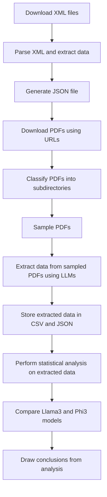

# Workflow Diagram

```mermaid
graph TD;
    A[Download XML files] --> B[Parse XML and extract data];
    B --> C[Generate JSON file];
    C --> D[Download PDFs using URLs];
    D --> E[Classify PDFs into subdirectories];
    E --> F[Sample PDFs];
    F --> G[Extract data from sampled PDFs using LLMs];
    G --> H[Store extracted data in CSV and JSON];
    H --> I[Perform statistical analysis on extracted data];
    I --> J[Compare Llama3 and Phi3 models];
    J --> K[Draw conclusions from analysis];
```